# Sequence Models (Contain summary of week 1-3)

## Recurrent Neural Networks

> Learn about recurrent neural networks. This type of model has been proven to perform extremely well on temporal data. It has several variants including LSTMs, GRUs and Bidirectional RNNs, which you are going to learn about in this section.

### Why sequence models
- Sequence Models like RNN and LSTMs have greatly transformed learning on sequences in the past few years.
- Examples of sequence data in applications:
  - Speech recognition (**sequence to sequence**):
    - X: wave sequence
    - Y: text sequence
  - Music generation (**one to sequence**):
    - X: nothing or an integer
    - Y: wave sequence
  - Sentiment classification (**sequence to one**):
    - X: text sequence
    - Y: integer rating from one to five
  - DNA sequence analysis (**sequence to sequence**):
    - X: DNA sequence
    - Y: DNA Labels
  - Machine translation (**sequence to sequence**):
    - X: text sequence (in one language)
    - Y: text sequence (in other language)
  - Video activity recognition (**sequence to one**):
    - X: video frames
    - Y: label (activity)
  - Name entity recognition (**sequence to sequence**):
    - X: text sequence
    - Y: label sequence
    - Can be used by seach engines to index different type of words inside a text.
- All of these problems with different input and output (sequence or not) can be addressed as supervised learning with label data X, Y as the training set.

### Notation
- In this section we will discuss the notations that we will use through the course.
- **Motivating example**:
  - Named entity recognition example:
    - X: "Harry Potter and Hermoine Granger invented a new spell."
    - Y:   1   1   0   1   1   0   0   0   0
    - Both elements has a shape of 9. 1 means its a name, while 0 means its not a name.
- We will index the first element of x by x<1>, the second x<2> and so on.
  - x<1> = Harry
  - x<2> = Potter
- Similarly, we will index the first element of y by y<1>, the second y<2> and so on.
  - y<1> = 1
  - y<2> = 1

- Tx is the size of the input sequence and Ty is the size of the output sequence.
  - Tx = Ty = 9 in the last example although they can be different in other problems.
- x(i)\<t> is the element t of the sequence of input vector i. Similarly y(i)\<t> means the t-th element in the output sequence of the i training example.
- Tx(i) the input sequence length for training example i. It can be different across the examples. Similarly for Ty(i) will be the length of the output sequence in the i-th training example.

- **Representing words**:
    - We will now work in this course with **NLP** which stands for natural language processing. One of the challenges of NLP is how can we represent a word?

    1. We need a **vocabulary** list that contains all the words in our target sets.
        - Example:
            - [a ... And   ... Harry ... Potter ... Zulu]
            - Each word will have a unique index that it can be represented with.
            - The sorting here is in alphabetical order.
        - Vocabulary sizes in modern applications are from 30,000 to 50,000. 100,000 is not uncommon. Some of the bigger companies use even a million.
        - To build vocabulary list, you can read all the texts you have and get m words with the most occurrence, or search online for m most occurrent words.
    2. Create a **one-hot encoding** sequence for each word in your dataset given the vocabulary you have created.
        - While converting, what if we meet a word thats not in your dictionary?
        - We can add a token in the vocabulary with name `<UNK>` which stands for unknown text and use its index for your one-hot vector.
    - Full example:   
        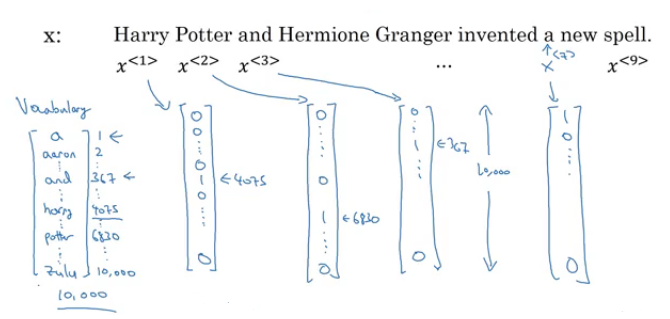

- The goal is given this representation for x to learn a mapping using a sequence model to then target output y as a supervised learning problem.

### Recurrent Neural Network Model
- Why not to use a standard network for sequence tasks? There are two problems:
  - Inputs, outputs can be different lengths in different examples.
    - This can be solved for normal NNs by paddings with the maximum lengths but it's not a good solution.
  - Doesn't share features learned across different positions of text/sequence.
    - Using a feature sharing like in CNNs can significantly reduce the number of parameters in your model. That's what we will do in RNNs.
- Recurrent neural network doesn't have either of the two mentioned problems.
- Lets build a RNN that solves **name entity recognition** task:   
    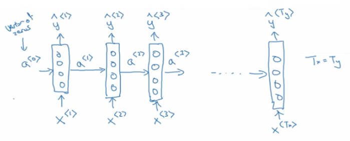
  - In this problem Tx = Ty. In other problems where they aren't equal, the RNN architecture may be different.
  - a<0> is usually initialized with zeros, but some others may initialize it randomly in some cases.
  - There are three weight matrices here: Wax, Waa, and Wya with shapes:
    - Wax: (NoOfHiddenNeurons, nx)
    - Waa: (NoOfHiddenNeurons, NoOfHiddenNeurons)
    - Wya: (ny, NoOfHiddenNeurons)
- The weight matrix Waa is the memory the RNN is trying to maintain from the previous layers.
- A lot of papers and books write the same architecture this way:  
  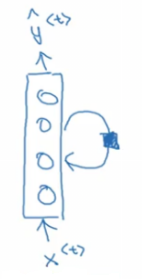
  - It's harder to interpreter. It's easier to roll this drawings to the unrolled version.
- In the discussed RNN architecture,  the current output y&#770;\<t> depends on the previous inputs and activations.
- Let's have this example 'He Said, "Teddy Roosevelt was a great president"'. In this example Teddy is a person name but we know that from the word **president** that came after Teddy not from **He** and **said** that were before it.
- So limitation of the discussed architecture is that it can not learn from elements later in the sequence. To address this problem we will later discuss **Bidirectional RNN**  (BRNN).
- Now let's discuss the forward propagation equations on the discussed architecture:   
    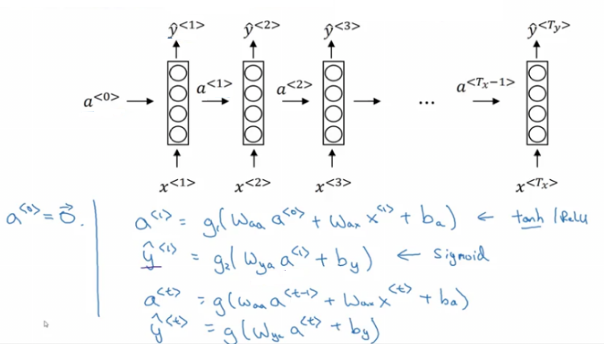
  - The activation function of a is usually tanh or ReLU and for y depends on your task choosing some activation functions like sigmoid and softmax. In name entity recognition task we will use sigmoid because we only have two classes.
- In order to help us develop complex RNN architectures, the last equations needs to be simplified a bit.
- **Simplified RNN notation**:   
    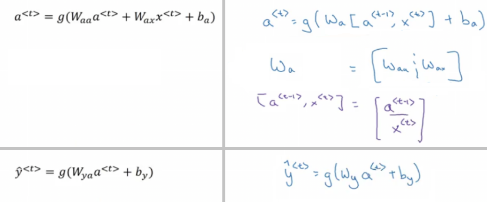
  - wa is waa and wax stacked horizontally.
  - [a\<t-1>, x\<t>] is a\<t-1> and x\<t> stacked vertically.
  - wa shape: (NoOfHiddenNeurons, NoOfHiddenNeurons + nx)
  - [a\<t-1>, x\<t>] shape: (NoOfHiddenNeurons + nx, 1)

### Backpropagation through time
- Let's see how backpropagation works with the RNN architecture.
- Usually deep learning frameworks do backpropagation automatically for you. But it's useful to know how it works in RNNs.
- Here is the graph:   
  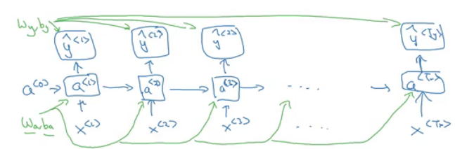
  - Where wa, ba, wy, and by are shared across each element in a sequence.
- We will use the cross-entropy loss function:   
  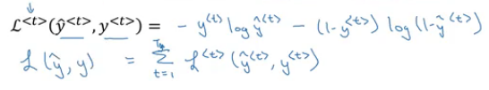
  - Where the first equation is the loss for one example and the loss for the whole sequence is given by the summation over all the calculated single example losses.
- Graph with losses:   
  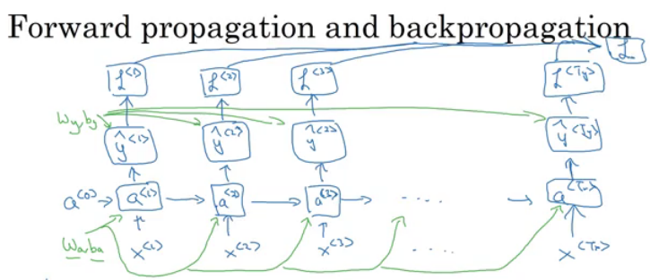
- The backpropagation here is called **backpropagation through time** because we pass activation `a` from one sequence element to another like backwards in time.

### Different types of RNNs
- So far we have seen only one RNN architecture in which Tx equals TY. In some other problems, they may not equal so we need different architectures.
- The ideas in this section was inspired by Andrej Karpathy [blog](http://karpathy.github.io/2015/05/21/rnn-effectiveness/). Mainly this image has all types:   
  
- The architecture we have described before is called **Many to Many**.
- In sentiment analysis problem, X is a text while Y is an integer that rangers from 1 to 5. The RNN architecture for that is **Many to One** as in Andrej Karpathy image.   
  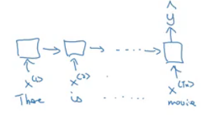
- A **One to Many** architecture application would be music generation.  
  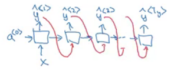
  - Note that starting the second layer we are feeding the generated output back to the network.
- There are another interesting architecture in **Many To Many**. Applications like machine translation inputs and outputs sequences have different lengths in most of the cases. So an alternative _Many To Many_ architecture that fits the translation would be as follows:   
  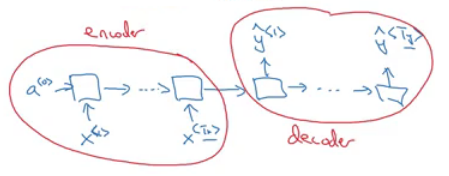
  - There are an encoder and a decoder parts in this architecture. The encoder encodes the input sequence into one matrix and feed it to the decoder to generate the outputs. Encoder and decoder have different weight matrices.
- Summary of RNN types:   
   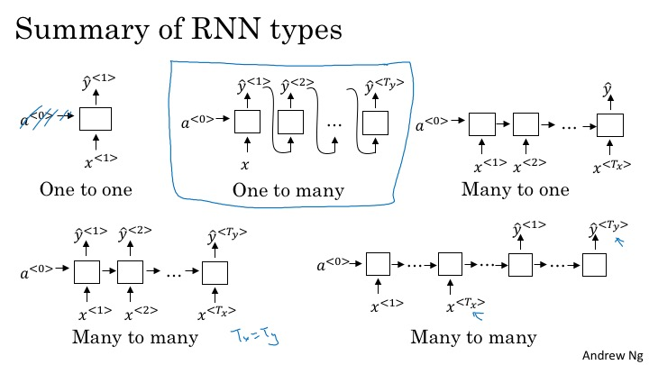
- There is another architecture which is the **attention** architecture which we will talk about in chapter 3.

### Language model and sequence generation
- RNNs do very well in language model problems. In this section, we will build a language model using RNNs.
- **What is a language model**
  - Let's say we are solving a speech recognition problem and someone says a sentence that can be interpreted into to two sentences:
    - The apple and **pair** salad
    - The apple and **pear** salad
  - **Pair** and **pear** sounds exactly the same, so how would a speech recognition application choose from the two.
  - That's where the language model comes in. It gives a probability for the two sentences and the application decides the best based on this probability.
- The job of a language model is to give a probability of any given sequence of words.
- **How to build language models with RNNs?**
  - The first thing is to get a **training set**: a large corpus of target language text.
  - Then tokenize this training set by getting the vocabulary and then one-hot each word.
  - Put an end of sentence token `<EOS>` with the vocabulary and include it with each converted sentence. Also, use the token `<UNK>` for the unknown words.
- Given the sentence "Cats average 15 hours of sleep a day. `<EOS>`"
  - In training time we will use this:   
    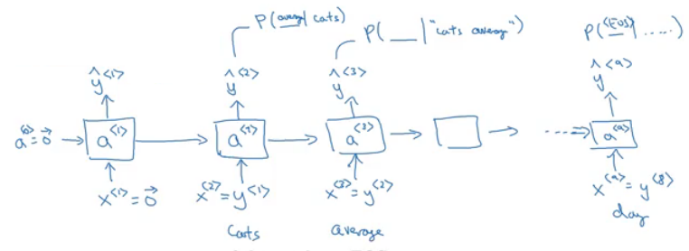
  - The loss function is defined by cross-entropy loss:   
    
    - `i`  is for all elements in the corpus, `t` - for all timesteps.
- To use this model:
  1.  For predicting the chance of **next word**, we feed the sentence to the RNN and then get the final y^\<t> hot vector and sort it by maximum probability.
  2.  For taking the **probability of a sentence**, we compute this:
      - p(y<1>, y<2>, y<3>) = p(y<1>) * p(y<2> | y<1>) * p(y<3> | y<1>, y<2>)
      - This is simply feeding the sentence into the RNN and multiplying the probabilities (outputs).

### Sampling novel sequences
- After a sequence model is trained on a language model, to check what the model has learned you can apply it to sample novel sequence.
- Lets see the steps of how we can sample a novel sequence from a trained sequence language model:
  1. Given this model:   
     
  2. We first pass a<0> = zeros vector, and x<1> = zeros vector.
  3. Then we choose a prediction randomly from distribution obtained by y&#770;<1>. For example it could be "The".
     - In numpy this can be implemented using: `numpy.random.choice(...)`
     - This is the line where you get a random beginning of the sentence each time you sample run a novel sequence.
  4. We pass the last predicted word with the calculated  a<1>
  5. We keep doing 3 & 4 steps for a fixed length or until we get the `<EOS>` token.
  6. You can reject any `<UNK>` token if you mind finding it in your output.
- So far we have to build a word-level language model. It's also possible to implement a **character-level** language model.
- In the character-level language model, the vocabulary will contain `[a-zA-Z0-9]`, punctuation, special characters and possibly <EOS> token.
- Character-level language model has some pros and cons compared to the word-level language model
  - Pros:
    1. There will be no `<UNK>` token - it can create any word.
  - Cons:
    1. The main disadvantage is that you end up with much longer sequences. 
    2. Character-level language models are not as good as word-level language models at capturing long range dependencies between how the the earlier parts of the sentence also affect the later part of the sentence.
    3. Also more computationally expensive and harder to train.
- The trend Andrew has seen in NLP is that for the most part, a word-level language model is still used, but as computers get faster there are more and more applications where people are, at least in some special cases, starting to look at more character-level models. Also, they are used in specialized applications where you might need to deal with unknown words or other vocabulary words a lot. Or they are also used in more specialized applications where you have a more specialized vocabulary.

### Vanishing gradients with RNNs
- One of the problems with naive RNNs that they run into **vanishing gradient** problem.

- An RNN that process a sequence data with the size of 10,000 time steps, has 10,000 deep layers which is very hard to optimize.

- Let's take an example. Suppose we are working with language modeling problem and there are two sequences that model tries to learn:

  - "The **cat**, which already ate ..., **was** full"
  - "The **cats**, which already ate ..., **were** full"
  - Dots represent many words in between.

- What we need to learn here that "was" came with "cat" and that "were" came with "cats". The naive RNN is not very good at capturing very long-term dependencies like this.

- As we have discussed in Deep neural networks, deeper networks are getting into the vanishing gradient problem. That also happens with RNNs with a long sequence size.   
  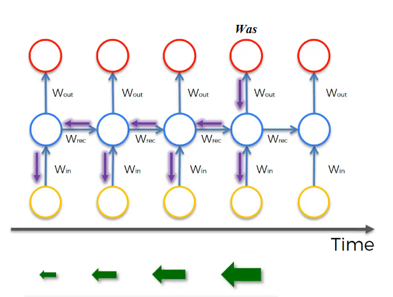   
  - For computing the word "was", we need to compute the gradient for everything behind. Multiplying fractions tends to vanish the gradient, while multiplication of large number tends to explode it.
  - Therefore some of your weights may not be updated properly.

- In the problem we descried it means that its hard for the network to memorize "was" word all over back to "cat". So in this case, the network won't identify the singular/plural words so that it gives it the right grammar form of verb was/were.

- The conclusion is that RNNs aren't good in **long-term dependencies**.

- > In theory, RNNs are absolutely capable of handling such “long-term dependencies.” A human could carefully pick parameters for them to solve toy problems of this form. Sadly, in practice, RNNs don’t seem to be able to learn them. http://colah.github.io/posts/2015-08-Understanding-LSTMs/

- _Vanishing gradients_ problem tends to be the bigger problem with RNNs than the _exploding gradients_ problem. We will discuss how to solve it in next sections.

- Exploding gradients can be easily seen when your weight values become `NaN`. So one of the ways solve exploding gradient is to apply **gradient clipping** means if your gradient is more than some threshold - re-scale some of your gradient vector so that is not too big. So there are cliped according to some maximum value.

  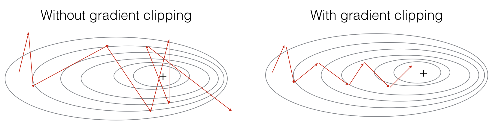

- **Extra**:
  - Solutions for the Exploding gradient problem:
    - Truncated backpropagation.
      - Not to update all the weights in the way back.
      - Not optimal. You won't update all the weights.
    - Gradient clipping.
  - Solution for the Vanishing gradient problem:
    - Weight initialization.
      - Like He initialization.
    - Echo state networks.
    - Use LSTM/GRU networks.
      - Most popular.
      - We will discuss it next.
 
### Gated Recurrent Unit (GRU)
- GRU is an RNN type that can help solve the vanishing gradient problem and can remember the long-term dependencies.

- The basic RNN unit can be visualized to be like this:   
  

- We will represent the GRU with a similar drawings.

- Each layer in **GRUs**  has a new variable `C` which is the memory cell. It can tell to whether memorize something or not.

- In GRUs, C\<t> = a\<t>

- Equations of the GRUs:   
  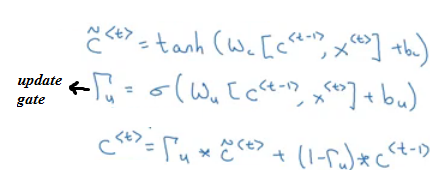
  - The update gate is between 0 and 1
    - To understand GRUs imagine that the update gate is either 0 or 1 most of the time.
  - So we update the memory cell based on the update cell and the previous cell.

- Lets take the cat sentence example and apply it to understand this equations:

  - Sentence: "The **cat**, which already ate ........................, **was** full"

  - We will suppose that U is 0 or 1 and is a bit that tells us if a singular word needs to be memorized.

  - Splitting the words and get values of C and U at each place:

    - | Word    | Update gate(U)             | Cell memory (C) |
      | ------- | -------------------------- | --------------- |
      | The     | 0                          | val             |
      | cat     | 1                          | new_val         |
      | which   | 0                          | new_val         |
      | already | 0                          | new_val         |
      | ...     | 0                          | new_val         |
      | was     | 1 (I don't need it anymore)| newer_val       |
      | full    | ..                         | ..              |
- Drawing for the GRUs   
  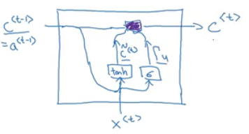
  - Drawings like in http://colah.github.io/posts/2015-08-Understanding-LSTMs/ is so popular and makes it easier to understand GRUs and LSTMs. But Andrew Ng finds it's better to look at the equations.
- Because the update gate U is usually a small number like 0.00001, GRUs doesn't suffer the vanishing gradient problem.
  - In the equation this makes C\<t> = C\<t-1> in a lot of cases.
- Shapes:
  - a\<t> shape is (NoOfHiddenNeurons, 1)
  - c\<t> is the same as a\<t>
  - c~\<t> is the same as a\<t>
  - u\<t> is also the same dimensions of a\<t>
- The multiplication in the equations are element wise multiplication.
- What has been descried so far is the Simplified GRU unit. Let's now describe the full one:
  - The full GRU contains a new gate that is used with to calculate the candidate C. The gate tells you how relevant is C\<t-1> to C\<t>
  - Equations:   
    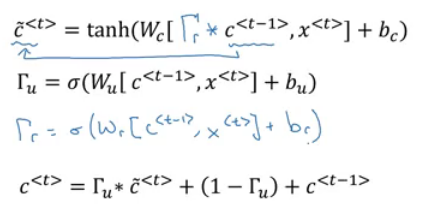
  - Shapes are the same
- So why we use these architectures, why don't we change them, how we know they will work, why not add another gate, why not use the simpler GRU instead of the full GRU; well researchers has experimented over years all the various types of these architectures with many many different versions and also addressing the vanishing gradient problem. They have found that full GRUs are one of the best RNN architectures  to be used for many different problems. You can make your design but put in mind that GRUs and LSTMs are standards.

### Long Short Term Memory (LSTM)
- LSTM - the other type of RNN that can enable you to account for long-term dependencies. It's more powerful and general than GRU.
- In LSTM , C\<t> != a\<t>
- Here are the equations of an LSTM unit:   
  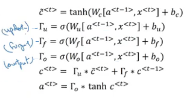
- In GRU we have an update gate `U`, a relevance gate `r`, and a candidate cell variables C\~\<t> while in LSTM we have an update gate `U` (sometimes it's called input gate I), a forget gate `F`, an output gate `O`, and a candidate cell variables C\~\<t>
- Drawings (inspired by http://colah.github.io/posts/2015-08-Understanding-LSTMs/):    
  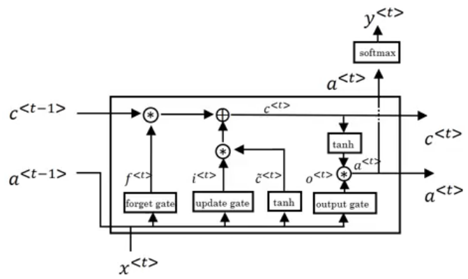
- Some variants on LSTM includes:
  - LSTM with **peephole connections**.
    - The normal LSTM with C\<t-1> included with every gate.
- There isn't a universal superior between LSTM and it's variants. One of the advantages of GRU is that it's simpler and can be used to build much bigger network but the LSTM is more powerful and general.

### Bidirectional RNN
- There are still some ideas to let you build much more powerful sequence models. One of them is bidirectional RNNs and another is Deep RNNs.
- As we saw before, here is an example of the Name entity recognition task:  
  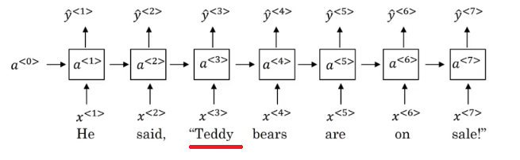
- The name **Teddy** cannot be learned from **He** and **said**, but can be learned from **bears**.
- BiRNNs fixes this issue.
- Here is BRNNs architecture:   
  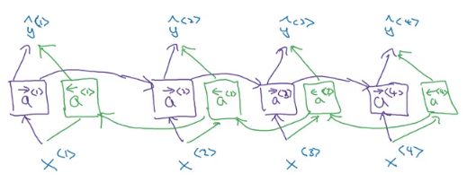
- Note, that BiRNN is an **acyclic graph**.
- Part of the forward propagation goes from left to right, and part - from right to left. It learns from both sides.
- To make predictions we use y&#770;\<t> by using the two activations that come from left and right.
- The blocks here can be any RNN block including the basic RNNs, LSTMs, or GRUs.
- For a lot of NLP or text processing problems, a BiRNN with LSTM appears to be commonly used.
- The disadvantage of BiRNNs that you need the entire sequence before you can process it. For example, in live speech recognition if you use BiRNNs you will need to wait for the person who speaks to stop to take the entire sequence and then make your predictions.

### Deep RNNs
- In a lot of cases the standard one layer RNNs will solve your problem. But in some problems its useful to stack some RNN layers to make a deeper network.
- For example, a deep RNN with 3 layers would look like this:  
  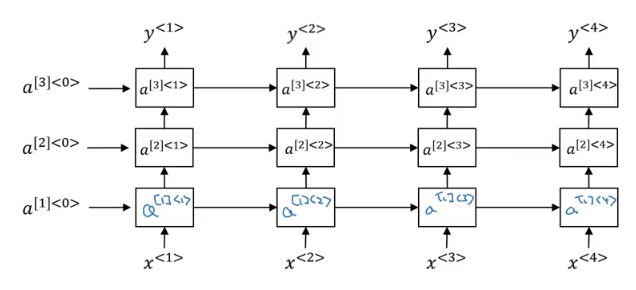
- In feed-forward deep nets, there could be 100 or even 200 layers. In deep RNNs stacking 3 layers is already considered deep and expensive to train.
- In some cases you might see some feed-forward network layers connected after recurrent cell.

### Back propagation with RNNs
- > In modern deep learning frameworks, you only have to implement the forward pass, and the framework takes care of the backward pass, so most deep learning engineers do not need to bother with the details of the backward pass. If however you are an expert in calculus and want to see the details of backprop in RNNs, you can work through this optional portion of the notebook.

- The quote is taken from this [notebook](https://www.coursera.org/learn/nlp-sequence-models/notebook/X20PE/building-a-recurrent-neural-network-step-by-step). If you want the details of the back propagation with programming notes look at the linked notebook.

## Natural Language Processing & Word Embeddings

> Natural language processing with deep learning is an important combination. Using word vector representations and embedding layers you can train recurrent neural networks with outstanding performances in a wide variety of industries. Examples of applications are sentiment analysis, named entity recognition and machine translation.

### Introduction to Word Embeddings

#### Word Representation
- NLP has been revolutionized by deep learning and especially by RNNs and deep RNNs.
- Word embeddings is a way of representing words. It lets your algorithm automatically understand the analogies between words like "king" and "queen".
- So far we have defined our language by a vocabulary. Then represented our words with a one-hot vector that represents the word in the vocabulary.
  - An image example would be:   
    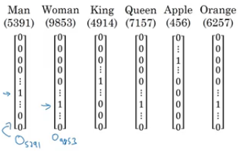
  - We will use the annotation **O** idx for any word that is represented with one-hot like in the image.
  - One of the weaknesses of this representation is that it treats a word as a thing that itself and it doesn't allow an algorithm to generalize across words.
    - For example: "I want a glass of **orange** ______", a model should predict the next word as **juice**.
    - A similar example "I want a glass of **apple** ______", a model won't easily predict **juice** here if it wasn't trained on it. And if so the two examples aren't related although orange and apple are similar.
  - Inner product between any one-hot encoding vector is zero. Also, the distances between them are the same.
- So, instead of a one-hot presentation, won't it be nice if we can learn a featurized representation with each of these words: man, woman, king, queen, apple, and orange?   
  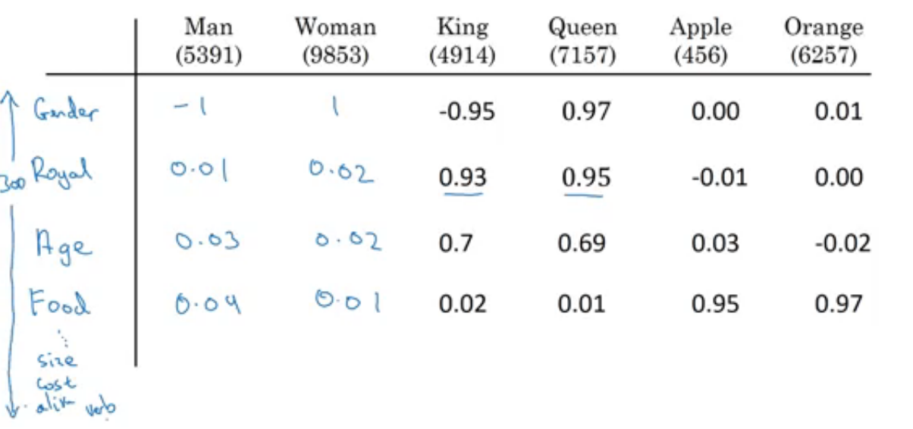
  - Each word will have a, for example, 300 features with a type of float point number.
  - Each word column will be a 300-dimensional vector which will be the representation.
  - We will use the notation **e**5391 to describe **man** word features vector.
  - Now, if we return to the examples we described again:
    -  "I want a glass of **orange** ______" 
    -  I want a glass of **apple** ______
  - Orange and apple now share a lot of similar features which makes it easier for an algorithm to generalize between them.
  - We call this representation **Word embeddings**.
- To visualize word embeddings we use a t-SNE algorithm to reduce the features to 2 dimensions which makes it easy to visualize:    
  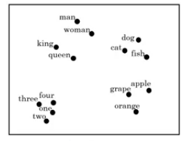
  - You will get a sense that more related words are closer to each other.
- The **word embeddings** came from that we need to embed a unique vector inside a n-dimensional space.

#### Using word embeddings
- Let's see how we can take the feature representation we have extracted from each word and apply it in the Named entity recognition problem.
- Given this example (from named entity recognition):   
  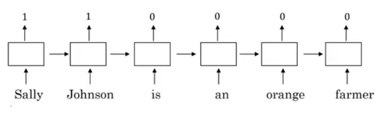
- **Sally Johnson** is a person's name.
- After training on this sentence the model should find out that the sentence "**Robert Lin** is an *apple* farmer" contains Robert Lin as a name, as apple and orange have near representations.
- Now if you have tested your model with this sentence "**Mahmoud Badry** is a *durian* cultivator" the network should learn the name even if it hasn't seen the word *durian* before (during training). That's the power of word representations.
- The algorithms that are used to learn **word embeddings** can examine billions of words of unlabeled text - for example, 100 billion words and learn the representation from them.
- Transfer learning and word embeddings:
  1. Learn word embeddings from large text corpus (1-100 billion of words).
     - Or download pre-trained embedding online.
  2. Transfer embedding to new task with the smaller training set (say, 100k words).
  3. Optional: continue to finetune the word embeddings with new data.
     - You bother doing this if your smaller training set (from step 2) is big enough.
- Word embeddings tend to make the biggest difference when the task you're trying to carry out has a relatively smaller training set.
- Also, one of the advantages of using word embeddings is that it reduces the size of the input!
  - 10,000 one hot compared to 300 features vector.
- Word embeddings have an interesting relationship to the face recognition task:   
  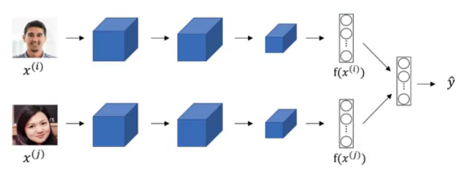
  - In this problem, we encode each face into a vector and then check how similar are these vectors.
  - Words **encoding** and **embeddings** have a similar meaning here.
- In the word embeddings task, we are learning a representation for each word in our vocabulary (unlike in image encoding where we have to map each new image to some n-dimensional vector). We will discuss the algorithm in next sections.

#### Properties of word embeddings
- One of the most fascinating properties of word embeddings is that they can also help with analogy reasoning. While analogy reasoning may not be by itself the most important NLP application, but it might help convey a sense of what these word embeddings can do.
- Analogies example:
  - Given this word embeddings table:   
    
  - Can we conclude this relation:
    - Man ==> Woman
    - King ==> ??
  - Lets subtract eMan from eWoman. This will equal the vector `[-2  0  0  0]`
  - Similar eKing - eQueen = `[-2  0  0  0]`
  - So the difference is about the gender in both.   
    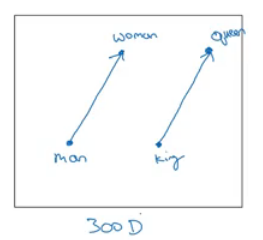
    - This vector represents the gender.
    - This drawing is a 2D visualization of the 4D vector that has been extracted by a t-SNE algorithm. It's a drawing just for visualization. Don't rely on the t-SNE algorithm for finding parallels.
  - So we can reformulate the problem to find:
    - eMan - eWoman ≈ eKing - e??
  - It can also be represented mathematically by:   
    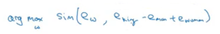
  - It turns out that eQueen is the best solution here that gets the the similar vector.
- Cosine similarity - the most commonly used similarity function:
  - Equation:   
    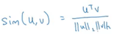
    - `CosineSimilarity(u, v)` = `u . v` / `||u|| ||v||` = cos(&theta;)
    - The top part represents the inner product of `u` and `v` vectors. It will be large if the vectors are very similar.
- You can also use Euclidean distance as a similarity function (but it rather measures a dissimilarity, so you should take it with negative sign).
- We can use this equation to calculate the similarities between word embeddings and on the analogy problem where `u` = ew and `v` = eking - eman + ewoman

#### Embedding matrix
- When you implement an algorithm to learn a word embedding, what you end up learning is a **<u>embedding matrix</u>**.
- Let's take an example:
  - Suppose we are using 10,000 words as our vocabulary (plus <UNK> token).
  - The algorithm should create a matrix `E` of the shape (300, 10000) in case we are extracting 300 features.   
    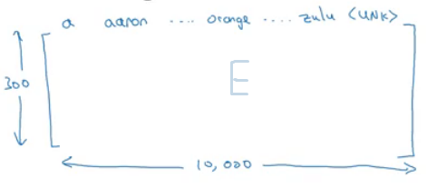
  - If O6257 is the one hot encoding of the word **orange** of shape (10000, 1), then   
    _np.dot(`E`,O6257) = e6257_ which shape is (300, 1).
  - Generally _np.dot(`E`, Oj) = ej_
- In the next sections, you will see that we first initialize `E` randomly and then try to learn all the parameters of this matrix.
- In practice it's not efficient to use a dot multiplication when you are trying to extract the embeddings of a specific word, instead, we will use slicing to slice a specific column. In Keras there is an embedding layer that extracts this column with no multiplication.

### Learning Word Embeddings: Word2vec & GloVe

#### Learning word embeddings
- Let's start learning some algorithms that can learn word embeddings.
- At the start, word embeddings algorithms were complex but then they got simpler and simpler.
- We will start by learning the complex examples to make more intuition.
- **<u>Neural language model</u>**:
  - Let's start with an example:   
    
  - We want to build a language model so that we can predict the next word.
  - So we use this neural network to learn the language model   
    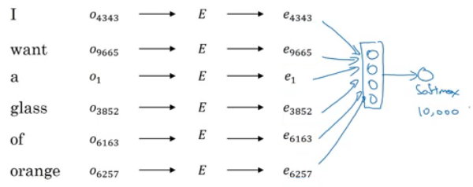
    - We get ej by `np.dot(`E`,oj)`
    - NN layer has parameters `W1` and `b1` while softmax layer has parameters `W2` and `b2`
    - Input dimension is (300*6, 1) if the window size is 6 (six previous words).
    - Here we are optimizing `E` matrix and layers parameters. We need to maximize the likelihood to predict the next word given the context (previous words).
  - This model was build in 2003 and tends to work pretty decent for learning word embeddings.
- In the last example we took a window of 6 words that fall behind the word that we want to predict. There are other choices when we are trying to learn word embeddings.
  - Suppose we have an example: "I want a glass of orange **juice** to go along with my cereal"
  - To learn **juice**, choices of **context** are:
    1. Last 4 words.
       - We use a window of last 4 words (4 is a hyperparameter), "<u>a glass of orange</u>" and try to predict the next word from it.
    2. 4 words on the left and on the right.
       - "<u>a glass of orange</u>" and "<u>to go along with</u>"
    3. Last 1 word.
       - "<u>orange</u>"
    4. Nearby 1 word.
       - "<u>glass</u>" word is near juice.
       - This is the idea of **skip grams** model. 
       - The idea is much simpler and works remarkably well.
       - We will talk about this in the next section.
- Researchers found that if you really want to build a _language model_, it's natural to use the last few words as a context. But if your main goal is really to learn a _word embedding_, then you can use all of these other contexts and they will result in very meaningful work embeddings as well. 
- To summarize, the language modeling problem poses a machines learning problem where you input the context (like the last four words) and predict some target words. And posing that problem allows you to learn good word embeddings.

#### Word2Vec
- Before presenting Word2Vec, lets talk about **skip-grams**:
  - For example, we have the sentence: "I want a glass of orange juice to go along with my cereal"
  - We will choose **context** and **target**.
  - The target is chosen randomly based on a window with a specific size.
   
    | Context | Target | How far |
    | ------- | ------ | ------- |
    | orange  | juice  | +1      |
    | orange  | glass  | -2      |
    | orange  | my     | +6      |    

    We have converted the problem into a supervised problem.
  - This is not an easy learning problem because learning within -10/+10 words (10 - an example) is hard.
  - We want to learn this to get our word embeddings model.
- Word2Vec model:
  - Vocabulary size = 10,000 words
  - Let's say that the context word are `c` and the target word is `t`
  - We want to learn `c` to `t`
  - We get ec by `E`. oc
  - We then use a softmax layer to get `P(t|c)` which is y&#770;
  - Also we will use the cross-entropy loss function.
  - This model is called skip-grams model.
- The last model has a problem with the softmax layer:   
  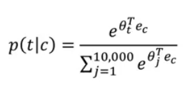
  - Here we are summing 10,000 numbers which corresponds to the number of words in our vocabulary.
  - If this number is larger say 1 million, the computation will become very slow.
- One of the solutions for the last problem is to use "**Hierarchical softmax classifier**" which works as a tree classifier.   
  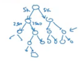
- In practice, the hierarchical softmax classifier doesn't use a balanced tree like the drawn one. Common words are at the top and less common are at the bottom.
- How to sample the context **c**?
  - One way is to choose the context by random from your corpus.
  - If you have done it that way, there will be frequent words like "the, of, a, and, to, .." that can dominate other words like "orange, apple, durian,..."
  - In practice, we don't take the context uniformly random, instead there are some heuristics to balance the common words and the non-common words.
- word2vec paper includes 2 ideas of learning word embeddings. One is skip-gram model and another is CBoW (continuous bag-of-words).

#### Negative Sampling
- Negative sampling allows you to do something similar to the skip-gram model, but with a much more efficient learning algorithm. We will create a different learning problem.
- Given this example:
  - "I want a glass of orange juice to go along with my cereal"
- The sampling will look like this:
- | Context | Word  | target |
  | ------- | ----- | ------ |
  | orange  | juice | 1      |
  | orange  | king  | 0      |
  | orange  | book  | 0      |
  | orange  | the   | 0      |
  | orange  | of    | 0      |

  We get positive example by using the same skip-grams technique, with a fixed window that goes around.
- To generate a negative example, we pick a word randomly from the vocabulary.
- Notice, that we got word "of" as a negative example although it appeared in the same sentence.
- So the steps to generate the samples are:
  1. Pick a positive context
  2. Pick a k negative contexts from the dictionary.
- k is recommended to be from 5 to 20 in small datasets. For larger ones - 2 to 5.
- We will have a ratio of k negative examples to 1 positive ones in the data we are collecting.
- Now let's define the model that will learn this supervised learning problem:
  - Lets say that the context word are `c` and the word are `t` and `y` is the target.
  - We will apply the simple logistic regression model.   
  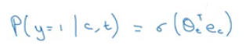
  - The logistic regression model can be drawn like this:   
  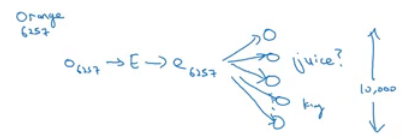
  - So we are like having 10,000 binary classification problems, and we only train k+1 classifier of them in each iteration.
- How to select negative samples:
  - We can sample according to empirical frequencies in words corpus which means according to how often different words appears. But the problem with that is that we will have more frequent words like _the, of, and..._
  - The best is to sample with this equation (according to authors):   
    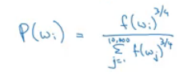

#### GloVe word vectors
- GloVe is another algorithm for learning the word embedding. It's the simplest of them.
- This is not used as much as word2vec or skip-gram models, but it has some enthusiasts because of its simplicity.
- GloVe stands for Global vectors for word representation.
- Let's use our previous example: "I want a glass of orange juice to go along with my cereal".
- We will choose a context and a target from the choices we have mentioned in the previous sections.
- Then we will calculate this for every pair: Xct = # times `t` appears in context of `c`
- Xct = Xtc if we choose a window pair, but they will not equal if we choose the previous words for example. In GloVe they use a window which means they are equal
- The model is defined like this:   
  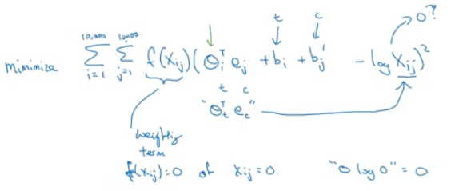
- f(x) - the weighting term, used for many reasons which include:
  - The `log(0)` problem, which might occur if there are no pairs for the given target and context values.
  - Giving not too much weight for stop words like "is", "the", and "this" which occur many times.
  - Giving not too little weight for infrequent words.
- **Theta** and **e** are symmetric which helps getting the final word embedding. 

- _Conclusions on word embeddings:_
  - If this is your first try, you should try to download a pre-trained model that has been made and actually works best.
  - If you have enough data, you can try to implement one of the available algorithms.
  - Because word embeddings are very computationally expensive to train, most ML practitioners will load a pre-trained set of embeddings.
  - A final note that you can't guarantee that the axis used to represent the features will be well-aligned with what might be easily humanly interpretable axis like gender, royal, age.

### Applications using Word Embeddings

#### Sentiment Classification
- As we have discussed before, Sentiment classification is the process of finding if a text has a positive or a negative review. Its so useful in NLP and is used in so many applications. An example would be:   
  
- One of the challenges with it, is that you might not have a huge labeled training data for it, but using word embeddings can help getting rid of this.
- The common dataset sizes varies from 10,000 to 100,000 words.
- A simple sentiment classification model would be like this:   
  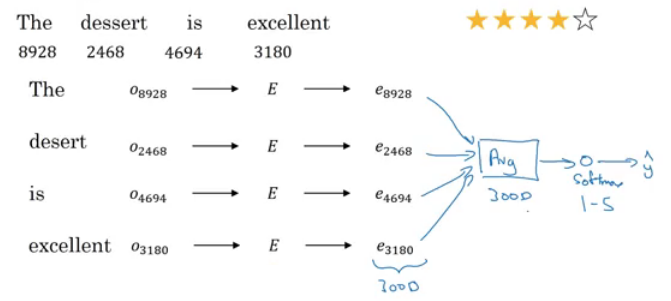
  - The embedding matrix may have been trained on say 100 billion words.
  - Number of features in word embedding is 300.
  - We can use **sum** or **average** given all the words then pass it to a softmax classifier. That makes this classifier works for short or long sentences.
- One of the problems with this simple model is that it ignores words order. For example "Completely lacking in **good** taste, **good** service, and **good** ambience" has the word _good_ 3 times but its a negative review.
- A better model uses an RNN for solving this problem:   
  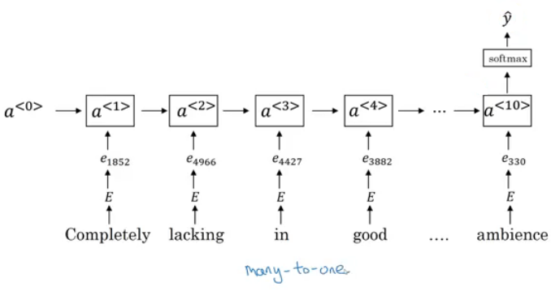
  - And so if you train this algorithm, you end up with a pretty decent sentiment classification algorithm.
  - Also, it will generalize better even if words weren't in your dataset. For example you have the sentence "Completely **<u>absent</u>** of good taste, good service, and good ambience", then even if the word "absent" is not in your label training set, if it was in your 1 billion or 100 billion word corpus used to train the word embeddings, it might still get this right and generalize much better even to words that were in the training set used to train the word embeddings but not necessarily in the label training set that you had for specifically the sentiment classification problem.

#### Debiasing word embeddings
- We want to make sure that our word embeddings are free from undesirable forms of bias, such as gender bias, ethnicity bias and so on.
- Horrifying results on the trained word embeddings in the context of Analogies:
  - Man : Computer_programmer as Woman : **Homemaker**
  - Father : Doctor as Mother : **Nurse**
- Word embeddings can reflect gender, ethnicity, age, sexual orientation, and other biases of text used to train the model.
- Learning algorithms by general are making important decisions and it mustn't be biased.
- Andrew thinks we actually have better ideas for quickly reducing the bias in AI than for quickly reducing the bias in the human race, although it still needs a lot of work to be done.
- Addressing bias in word embeddings steps:
  - Idea from the paper: https://arxiv.org/abs/1607.06520
  - Given these learned embeddings:   
    
  - We need to solve the **gender bias** here. The steps we will discuss can help solve any bias problem but we are focusing here on gender bias.
  - Here are the steps:
    1. Identify the direction:
       - Calculate the difference between:
         - ehe - eshe
         - emale - efemale
         - ....
       - Choose some k differences and average them.
       - This will help you find this:   
         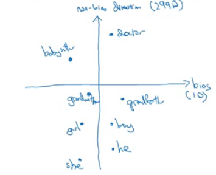
       - By that we have found the bias direction which is 1D vector and the non-bias vector which is 299D vector.
    2. Neutralize: For every word that is not definitional, project to get rid of bias.
       - Babysitter and doctor need to be neutral so we project them on non-bias axis with the direction of the bias:   
         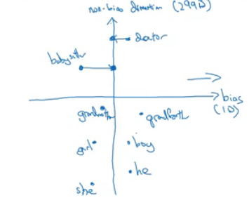
         - After that they will be equal in the term of gender.
         - To do this the authors of the paper trained a classifier to tell the words that need to be neutralized or not.
    3. Equalize pairs
       - We want each pair to have difference only in gender. Like:
         - Grandfather - Grandmother
         - He - She
         - Boy - Girl
       - We want to do this because the distance between grandfather and babysitter is bigger than babysitter and grandmother:   
         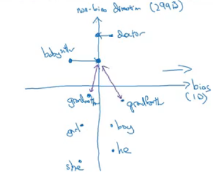
       - To do that, we move grandfather and grandmother to a point where they will be in the middle of the non-bias axis.
       - There are some words you need to do this for in your steps. Number of these words is relatively small.