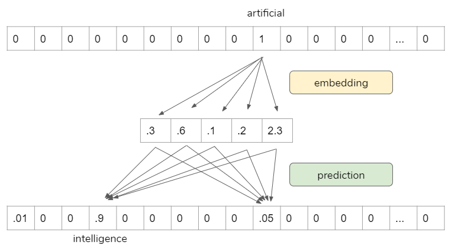
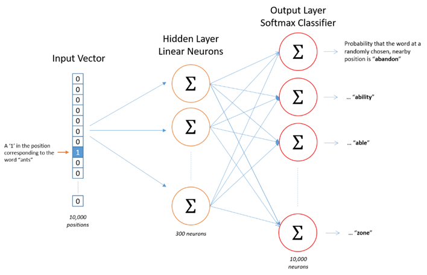
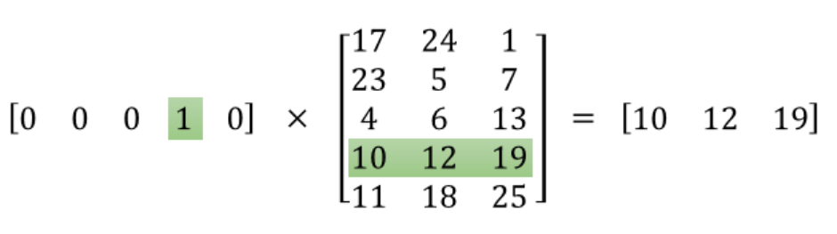

# Word2vec

The basic idea of Word2vec is that instead of representing words as one-hot encoding (<b>countvectorizer / tfidfvectorizer</b>) in high dimensional space, we represent words in dense low dimensional space in a way that similar words get similar word vectors, so they are mapped to nearby points.
<p>

**Word2vec is not deep neural network, it turns text into a numeric form that deep neural network can process as input.**

## How the word2vec model is trained

* Move through the training corpus with a sliding window: Each word is a prediction problem.
* The objective is to predict the current word using the neighboring words (or vice versa).
* The outcome of the prediction determines whether we adjust the current word vector. Gradually, vectors converge to (hopefully) optimal values.

For example, we can use “artificial” to predict “intelligence”.



## Word2vec Skip-gram Network Architecture
This is one of word2vec models architectures. It is just a simple one hidden layer and one output layer.



## The Math
The following is the math behind word2vec embedding. The input layer is the one-hot encoded vectors, so it gets “1” in that word index, “0” everywhere else. When we multiply this input vector by weight matrix, we are actually pulling out one row that is corresponding to that word index. The objective here is to pull out the important row(s), then, we toss the rest.



*This is the main mechanics on how word2vec works.*

When we use Tensorflow / Keras or Pytorch to do this, they have a special layer for this process called “Embedding layer”. So, we are not going to do math by ourselves, we only need to pass one-hot encoded vectors, the “Embedding layer” does all the dirty works.

## Pre-process the text

Now we are going to implement word2vec embedding for a BBC news data set.
* We use Gensim to train word2vec embedding.
* We use NLTK and spaCy to pre-process the text.
* We use t-SNE to visualize high-dimensional data.

```python
def clean_text(text):
    '''Make text lowercase, remove text in square brackets, remove punctuation and remove words containing numbers.'''
    text = text.lower()
    text = re.sub(r'\[.*?\]', '', text)
    text = re.sub(r'[%s]' % re.escape(string.punctuation), '', text)
    text = re.sub(r'\w*\d\w*', '', text)
    # Remove a sentence if it is only one word long
    if len(text) > 2:
        return ' '.join(word for word in text.split() if word not in STOPWORDS)

df_clean = pd.DataFrame(df.text.apply(lambda x: clean_text(x)))
```

* We use spaCy for lemmatization.
* Disabling Named Entity Recognition for speed.
* Remove pronouns.

```python
nlp = spacy.load('en', disable=['ner', 'parser']) # disabling Named Entity Recognition for speed

def lemmatizer(text):        
    sent = []
    doc = nlp(text)
    for word in doc:
        sent.append(word.lemma_)
    return " ".join(sent)

df_clean["text_lemmatize"] =  df_clean.apply(lambda x: lemmatizer(x['text']), axis=1)
df_clean['text_lemmatize_clean'] = df_clean['text_lemmatize'].str.replace('-PRON-', '')

```

* Now we can have a look top 10 most frequent words.

```python
sentences = [row.split() for row in df_clean['text_lemmatize_clean']]
word_freq = defaultdict(int)
for sent in sentences:
    for i in sent:
        word_freq[i] += 1

sorted(word_freq, key=word_freq.get, reverse=True)[:10]
```

## Implementing Word2vec embedding in Gensim

- <code>min_count</code>: Minimum number of occurrences of a word in the corpus to be included in the model. The higher the number, the less words we have in our corpus.
- <code>window</code>: The maximum distance between the current and predicted word within a sentence.
- <code>size</code>: The dimensionality of the feature vectors.
- <code>workers</code>: I know my system is having 4 cores.
- <code>model.build_vocab</code>: Prepare the model vocabulary.
- <code>model.train</code>: Train word vectors.
- <code>model.init_sims()</code>: When we do not plan to train the model any further, we use this line of code to make the model more memory-efficient.

## Conclusion

* It is obvious that some words are close to each other, such as “team”, “goal”, “injury”, “olympic” and so on. And those words tend to be used in the sport related news articles.
* Other words that cluster together such as “film”, “actor”, “award”, “prize” and so on, they are likely to be used in the news articles that talk about entertainment.

## References

[1] https://learning.oreilly.com/videos/oreilly-strata-data/9781492050681/9781492050681-video327451?autoplay=false

[2] http://mccormickml.com/2016/04/19/word2vec-tutorial-the-skip-gram-model/

[3] https://www.infoq.com/presentations/nlp-practitioners/
